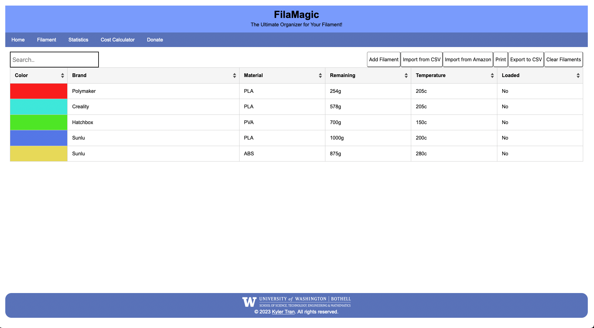

# FilaMagic

**Copyright &copy; 2023 Kyler Tran**

FilaMagic is a user-friendly web application designed to help 3D printing enthusiasts and professionals manage their filament inventory effectively. With FilaMagic, you can track various attributes of your 3D printer filaments, such as material, color, brand, ideal print settings, and remaining weight, all from one convenient online platform.

## Features

- **Comprehensive Filament Tracking**: Easily add and manage details about each filament spool, including material, color, brand, and ideal print settings.
- **Automatic Data Storage**: All filament data is automatically stored in your browser cache, ensuring that your information is saved between sessions without the need for manual backups.
- **Visual Data Representation**: View all your filament information in an organized table that allows for easy sorting and access.
- **Remaining Weight Tracker**: Keep track of how much filament is left on each spool to help plan your print jobs better.

## Data Privacy

- All data is stored locally in your browser's cache; no personal data is sent to or stored on our servers.

## Contact
Kyler Tran  
**Email**: [kylerzinbox@gmail.com](mailto:kylerzinbox@gmail.com)

